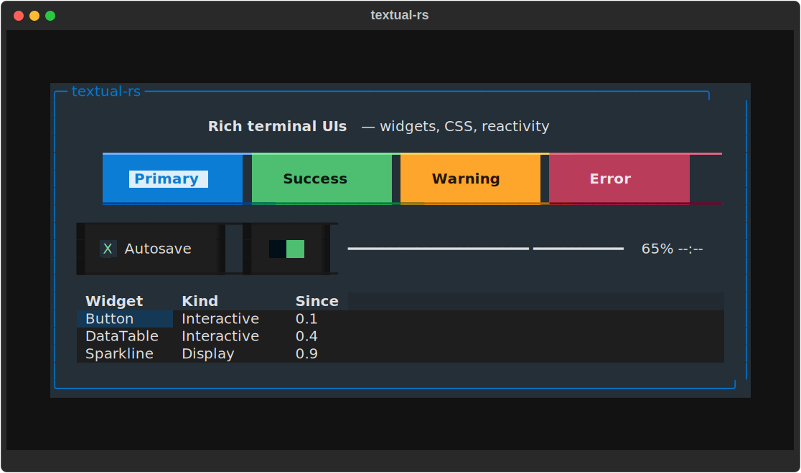
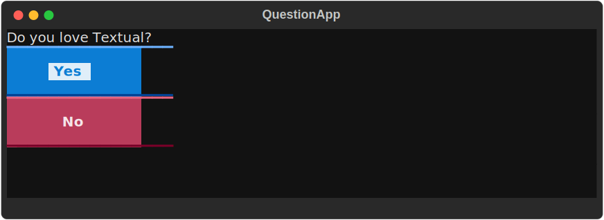
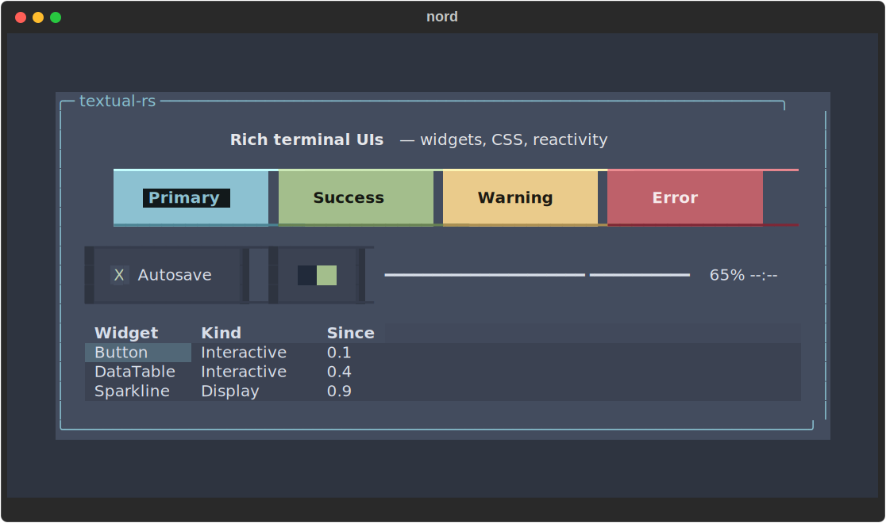
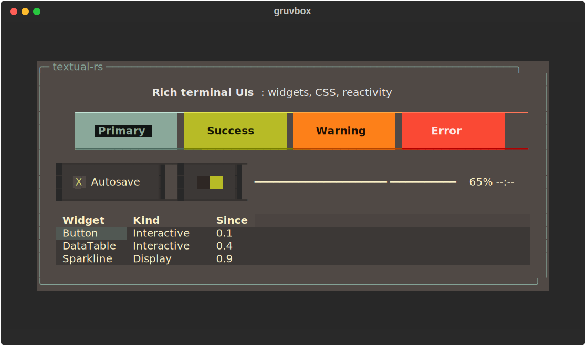
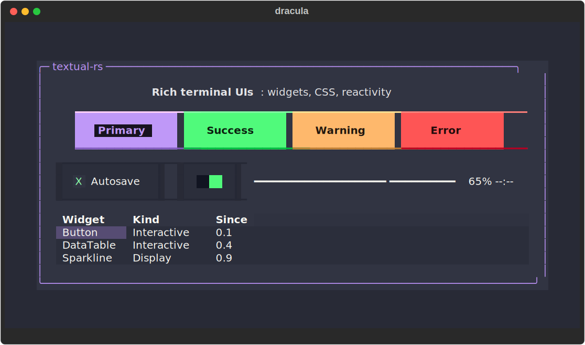
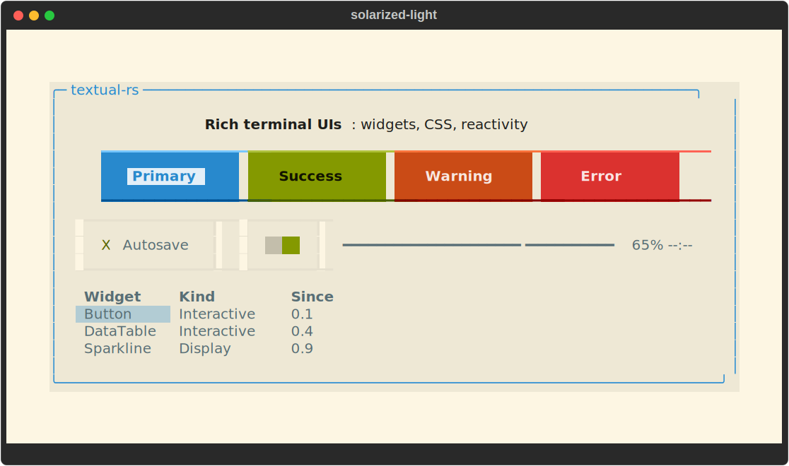
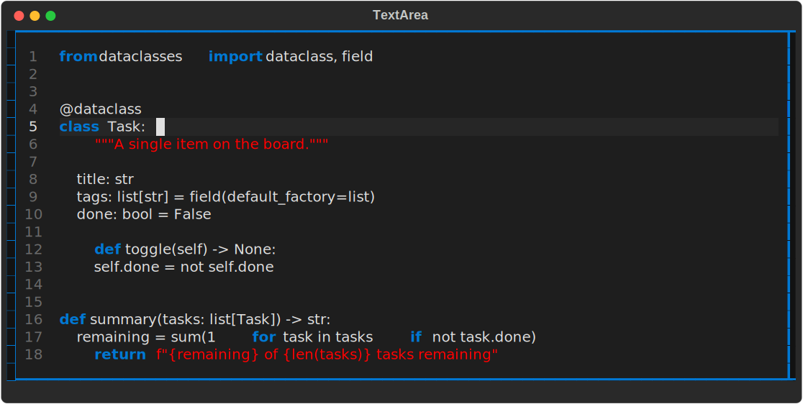
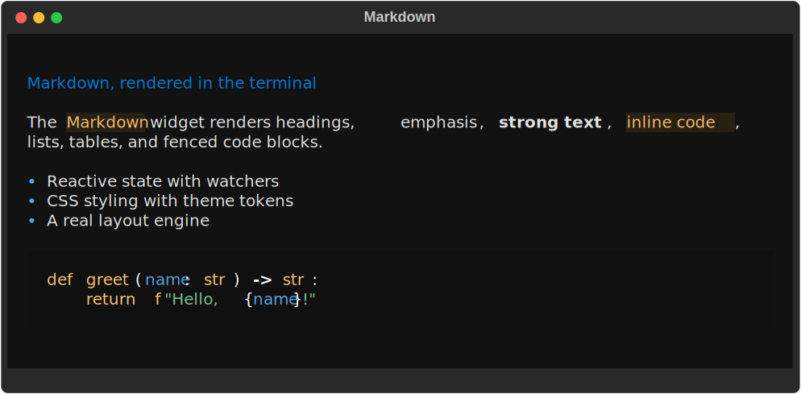
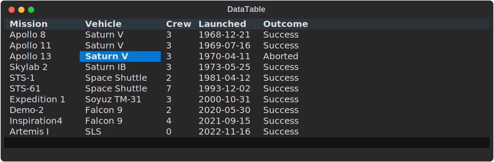
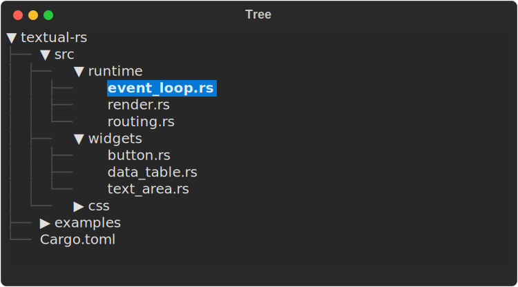

# textual-rs

[](https://crates.io/crates/textual)
[](https://docs.rs/textual)
[](https://opensource.org/licenses/MIT)

**A reactive TUI framework for Rust.** Build rich terminal applications from composable
widgets, style them with CSS, lay them out with a real box model, and drive them with
reactive state and an event/message runtime, a faithful Rust port of Python's
[Textual](https://github.com/Textualize/textual).



> **Attribution.** textual-rs is a derivative work: a Rust port of
> [Textual](https://github.com/Textualize/textual), created by Will McGugan and the
> [Textualize](https://www.textualize.io/) team. All credit for the original framework
> design, API, and concepts goes to them. This project exists only because of their work
> and aims to bring that experience to Rust. Published on crates.io as the `textual` crate.

## Compatibility

Runs on Linux, macOS, and Windows. True color, Unicode, and mouse work on modern
terminals. **Minimum Supported Rust Version: 1.85** (Rust 2024 edition). Built on
[`rich-rs`](https://crates.io/crates/rich-rs) for rendering and
[`crossterm`](https://crates.io/crates/crossterm) for terminal I/O.

## Install

```toml
[dependencies]
textual = "1.0"
```

## A complete app

This is a whole Textual application: a question with two buttons that prints your
answer when you pick one. It gets a themed UI, mouse **and** keyboard handling, and
focus management for free:

```rust
use textual::prelude::*;

struct QuestionApp {
    reply: Option<String>,
}

impl TextualApp for QuestionApp {
    fn compose(&mut self) -> AppRoot {
        AppRoot::new()
            .with_child(Label::new("Do you love Textual?"))
            .with_child(Button::primary("Yes").id("yes"))
            .with_child(Button::error("No").id("no"))
    }

    fn on_message(&mut self, message: &MessageEvent, ctx: &mut textual::event::WidgetCtx) {
        if let Some(m) = message.downcast_ref::<ButtonPressed>() {
            if let Some(id) = &m.button_id {
                self.reply = Some(id.clone());
            }
            ctx.request_stop();
            ctx.set_handled();
        }
    }

    fn take_exit_output(&mut self) -> Option<String> {
        self.reply.take()
    }
}

fn main() -> Result<()> {
    if let Some(reply) = run_sync_with_output(QuestionApp { reply: None })? {
        println!("You chose: {reply}");
    }
    Ok(())
}
```



Want to see the framework in action first? The Python documentation examples are ported
verbatim and runnable:

```bash
tools/run-doc-example.sh widgets buttons       # button states, variants, focus
tools/run-doc-example.sh widgets data_table    # sortable, keyboard-driven table
tools/run-doc-example.sh widgets text_area_example  # syntax-highlighted editor
tools/run-doc-example.sh guide/screens modal01      # modal screens
```

## Reactive state

Textual's signature feature: declare state as **reactive** fields and *watchers* run
automatically whenever the value changes, with no manual "now update the UI" plumbing.

```rust
use textual::prelude::*;

#[derive(Reactive)]
struct ColorApp {
    // Assigning a new value fires `watch_color(old, new)`, which can query and
    // restyle widgets, post messages, or trigger a re-layout.
    #[reactive(watch_with_app)]
    color: Color,
}
```

Reactive fields also support `compute`d values, `validate` hooks, and field-to-field
`data_bind`, mirroring Python Textual's reactivity model.

## Styling with CSS

Stylesheets use Textual's TCSS syntax: selectors, the cascade with specificity and
`!important`, theme tokens, and nested `&` rules:

```css
Button {
    width: auto;
    min-width: 16;
    content-align: center middle;

    &.-style-flat {
        text-style: bold;
        color: auto 90%;
        background: $surface;
        border: block $surface;

        &:hover {
            background: $primary;
            border: block $primary;
        }
    }
}
```

Supported selectors: type, `#id`, `.class`, pseudo-classes (`:hover`, `:focus`,
`:active`, `:disabled`, `:can-focus`, `:dark`, `:light`, `:even`, `:odd`,
`:first-child`, `:last-child`, and more), descendant (` `), child (`>`), grouping
(`,`), universal (`*`). Theme tokens (`$primary`, `$surface`, `$error-darken-2`, …)
resolve against the active theme with lighten/darken/muted derivations. Load external
`.tcss` files and hot-reload them with `App::watch_stylesheet()`.

### Themes

Every colour token resolves against the active theme, so one line re-skins the whole
app (`app.set_theme_by_name("nord")`), and `App::register_theme` adds your own. The
same screen under four of the 21 built-in themes:

| | |
|:---:|:---:|
|  |  |
|  |  |

Built-in: `textual-dark`, `textual-light`, `nord`, `gruvbox`, `dracula`, `tokyo-night`,
`monokai`, `flexoki`, `catppuccin-mocha`, `catppuccin-latte`, `catppuccin-frappe`,
`catppuccin-macchiato`, `solarized-dark`, `solarized-light`, `rose-pine`,
`rose-pine-moon`, `rose-pine-dawn`, `atom-one-dark`, `atom-one-light`, `ansi-dark`,
`ansi-light`.

### Animation

Styles animate through CSS transitions with easing curves: declare which properties
interpolate and the runtime animator tweens them on state changes (colors, opacity,
dimensions, offsets):

```css
Button {
    transition: background 200ms ease-in-out, opacity 300ms linear;
}
```

## Layout

Five layout modes (**vertical**, **horizontal**, **grid**, **dock**, and **absolute**)
over a Python-faithful border-box model (margin collapsing, padding, border), with:

- **Size units:** cells (`20`), `auto`, percentage (`50%`), fractions (`1fr`), viewport (`100vw`, `50vh`)
- **Constraints:** `min-width` / `max-width` / `min-height` / `max-height`
- **Scrolling:** `overflow: auto | hidden | scroll` with real scrollbars

## Widgets

Over 40 first-class widgets, with proper focus, keyboard and mouse behavior, component
styles, messages, and tests:

**Interactive:** Button, Input, MaskedInput, TextArea, Checkbox, RadioSet, Switch,
Select, OptionList, SelectionList, ListView, DataTable, Tree, DirectoryTree, Tabs,
TabbedContent, Collapsible, CommandPalette, Link

**Display:** Label / Static, Text, Markdown, Pretty, Digits, ProgressBar,
LoadingIndicator, Sparkline, RichLog, Log, Toast, Rule, Spacer, Placeholder, HelpPanel,
KeyPanel

**Containers:** Container, ScrollView, Frame, Panel, Overlay, Constrained, Styled

A few of them up close. `TextArea` is a code editor with tree-sitter syntax
highlighting, line numbers, and selections:



`Markdown` renders documents in the terminal, including headings, lists, tables, and
highlighted code blocks:



`DataTable` scales to large datasets with fixed rows/columns, sorting, and a
keyboard-driven cell cursor:



`Tree` (and `DirectoryTree`) present hierarchical data with expandable nodes:



## Headless testing

Every app and widget is testable **without a real terminal** via the in-process `Pilot`
harness. Press keys, click, pause, and assert on the live state:

```rust
run_test(QuestionApp { reply: None }, |pilot| {
    assert!(!pilot.app().headless_stop_requested());
    pilot.click("#yes")?;                       // fire the button
    assert!(pilot.app().headless_stop_requested()); // handler ran, app exiting
    Ok(())
})?;
```

This backs **3,100+ tests**: unit, integration, snapshot (via `insta`), and real-PTY
parity harnesses that diff Rust against the actual Python Textual output cell-by-cell.

## Architecture

```
Widget tree → rich-rs Segments (with metadata) → FrameBuffer (2D grid) → frame diff → ANSI output
```

- **Event routing:** capture phase (root → focused) then bubble phase (focused → root)
- **Style resolution:** CSS cascade with specificity, inheritance, and `!important`
- **Rendering:** dirty-flag driven; only changed cells are repainted; hit-testing survives repaints via segment metadata
- **`unsafe` forbidden:** enforced by lint configuration

## Python parity

Python Textual is the source of truth for behavior and default styling. The port aligns:

1. **Semantics first:** event/focus/message behavior, layout/box-model rules
2. **Defaults second:** the 16 widget default CSS files match Python Textual verbatim
3. **Visuals third:** render-time composition, border painting, opacity blending

Parity is a continuously measured *verification floor*, not a demo emulation: styled
per-cell-RGB **87/87**, plain-text PTY **186/186**, and real-app interactive parity
against live Python with only a handful of intentional divergences (see `KNOWN_GAPS.md`).
Rust idioms (ownership, type safety, modular boundaries) are used throughout while
preserving behavioral parity.

## Build and test

```bash
cargo build      # build the library
cargo test       # run the test suite
cargo clippy     # lint
cargo fmt        # format
```

### Debugging

Opt-in, filterable instrumentation via environment variables:

```bash
TEXTUAL_DEBUG_STYLE_FILE=/tmp/style.log    # CSS resolution
TEXTUAL_DEBUG_LAYOUT_FILE=/tmp/layout.log  # layout calculations
TEXTUAL_DEBUG_INPUT_FILE=/tmp/input.log    # input events
TEXTUAL_DEBUG_RENDER_FILE=/tmp/render.log  # rendering
TEXTUAL_DEBUG_FOCUS=1                       # focus changes (stderr)
```

Narrow the output with a filter: `TEXTUAL_DEBUG_STYLE_FILTER='type=Button,class=error'`.

## Status

**1.0**, the first stable release. See [`CHANGELOG.md`](CHANGELOG.md) for the release notes,
[`KNOWN_GAPS.md`](KNOWN_GAPS.md) for the honest, tracked set of remaining divergences (all
intentional or the deferred 1.1 inline-render feature), and [`ROADMAP.md`](ROADMAP.md) for
1.x direction.

## License

MIT. See [`LICENSE`](LICENSE). Original Textual framework © the Textualize team.
